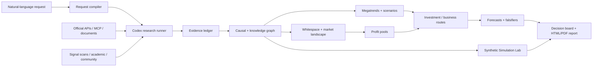

# Opportunity Intelligence

**Evidence-backed market foresight, whitespace discovery, investment analysis, and decision simulation in one local workbench.**

[日本語](#日本語) · [English](#english) · [简体中文](#简体中文) · [MCP catalog](docs/MCP-CATALOG.md) · [Product specification](docs/PRODUCT-SPEC.md)

> Opportunity Intelligence is a local, personal decision-intelligence system. It turns an open-ended question into an inspectable chain of evidence, causal logic, market structure, scenarios, opportunities, actions, and falsifiers. It does not promise investment returns and does not execute trades.

---

## 日本語

### これは何か

Opportunity Intelligenceは、「今後何が起きるか」だけでなく、「なぜそう考えるのか」「競争が過熱している場所と未充足領域はどこか」「誰の利益がどこに移るか」「投資・事業として何を実行し、何を避けるべきか」までを、同じ証拠台帳から組み立てるローカル分析ワークベンチです。

市場調査、経営企画、新規事業、投資調査、政策・規制分析、技術探索などで、検索結果の要約ではなく、判断可能な成果物を作ることを目的としています。自然言語で依頼を作成し、Codexがリポジトリ内の専用スキルを実行します。別のAI APIキーは不要です。ただし、外部データ提供者が独自に要求するAPIキーは利用者ごとに設定します。

### 解決する問題

- メガトレンドという言葉だけで終わり、構造ドライバーや反証条件が見えない
- ホワイトスペースが「誰もいなさそう」という印象論になり、競合密度・代替手段・支払意思を証明できない
- 利益プールの「誰の利益か」「地域・期間・単位」が曖昧
- 一次情報、業界情報、推論、仮定、合成シミュレーションが混ざる
- 分析が文章だけで、因果グラフ、トレンドレーダー、シナリオ、企業・サービスとの接続が見えない
- 分析後の監視指標、停止条件、反証日、予測精度が残らない

### 主な機能

1. **依頼コンパイラ** — 自然言語から判断種類、地域、産業、時間軸、制約、必要方法論を構造化します。
2. **Evidence Ledger** — URL、発行者、取得日、source tier、Fact / Inference / Assumption / Unknown、限界、反証を記録します。
3. **Megatrend Radar** — トレンドの持続性、構造ドライバー、波及経路、確度、観測指標を分離します。
4. **Causal & Knowledge Graph** — ドライバー、制約、主体、結果、正負の因果、フィードバックループを可視化します。
5. **Whitespace Proof** — 顧客ジョブ、既存代替、競争密度、飽和、未充足、支払意思、実行可能性をゲート判定します。
6. **Market Landscape** — メガトレンドや機会に関連する国内外の上場企業、未上場企業、製品、サービスを接続します。
7. **Profit Pool** — 誰の利益か、指標、単位、地域、基準年、期間、価値移動を明示します。
8. **Investment / Business Routes** — 投資ルートと事業ルートを分け、参入条件、証拠ゲート、リスク、停止条件を提示します。
9. **Scenario Planning & Forecast Registry** — 複数シナリオ、先行指標、確率更新、YES / NO解決、Brier scoreを保存します。
10. **Simulation Lab** — MiroFishに着想を得た、Codexによる証拠境界付き合成マルチエージェント・シミュレーションです。
11. **Report Export** — 完成runの全タグを、単一HTMLまたは印刷対応PDFとして出力します。
12. **MCP / Data Registry** — 利用可能、キー設定待ち、未導入、手動取込、劣化状態を分けて表示します。

### 方法論

単語だけを並べるのではなく、各runの`methodology`に実施手順、反映先、逸脱、証拠IDを保存します。

- Horizon scanning / weak-signal scanning
- STEEP / PESTLE
- Three Horizons
- Futures Wheel / cross-impact
- Causal mapping / feedback loops
- Reference-class forecasting / base rates
- Scenario planning / signposts
- Delphi-style structured judgment
- Superforecasting discipline / calibration
- Technology S-curves / diffusion
- Experience curves / Wright's law
- Jobs-to-be-Done
- Whitespace / Blue Ocean proof gates
- Value-chain and profit-pool analysis
- Real options / staged commitment
- Pre-mortem, red team, counterarguments, falsifiers
- MiroFish-inspired synthetic multi-agent world simulation

### Simulation Labの境界

Simulation Labは上流のMiroFishランタイムそのものではありません。MiroFishの発想を取り入れたOpportunity Intelligence独自の個人利用向け実装です。Codexをモデル実行環境として使い、別のOpenAI APIキーを要求しません。

各主体には異なる目的、制約、能力、判断規則、証拠アンカーを与えます。ラウンドごとの主体状態、交渉・投資・拒否・協力・規制・情報・競争の相互作用、少数意見、介入、無介入対照、分岐、失敗条件を保存します。出力はすべて`synthetic`であり、観測事実や統計的予測として扱いません。

### MCP・データ接続

リポジトリには、導入済みのMCPだけでなく、今後活用する候補を含む全接続カタログを収録します。AI APIキーとデータ提供者のAPIキーは別物です。キーはGitHubへ保存せず、各利用者が自分のPCで設定します。

対象には、日本政府、e-Stat、法令・税法・労務、EDINET、SEC EDGAR、World Bank Data360、IMF、Eurostat、Data.gov、U.S. Census、data.gouv.fr、FAOSTAT、UNIDO、USGS、Materials Project、Crossref、arXiv、Europe PMC、CiNii、国会議事録、気象、不動産・地理、企業登記、Companies House、OpenCorporates、GLEIF、Reddit、Qiitaなどを含みます。

詳細は[全MCP・データ接続カタログ](docs/MCP-CATALOG.md)を参照してください。

### 同梱ショーケース

clone直後から完成済み事例を画面で確認できます。個人案件の「パークタワー東雲」は含めていません。

| Run | テーマ | 証拠 | Simulation Lab |
|---|---|---:|---|
| `20260724214716-cb5efd` | ドル円今後どうなる | 11 | 実行待ち |
| `20260724225108-af98b3` | 半導体価格 | 26 | 未実行 |
| `20260725003136-55b62a` | 東京タワーマン相場 | 20 | 完了 |
| `20260725042538-b1b56f` | 日本国内データセンター予測 | 44 | 完了 |

### Windowsでの開始

必要条件はNode.js 20以上です。

```powershell
git clone https://github.com/0xpandadev/Opportunity-Intelligence.git
cd Opportunity-Intelligence
START.cmd
```

または：

```powershell
node server.cjs
```

ブラウザで`http://127.0.0.1:4317`を開きます。分析実行にはCodexデスクトップでrun専用の依頼文を実行します。

### 別PCのMCP

`git clone`はMCP情報とセットアップ手順を取得しますが、安全上、外部プログラムを無断でインストールしません。MCPの導入は明示的に実行します。

```powershell
powershell -ExecutionPolicy Bypass -File scripts/setup-mcp.ps1 -Profile core
```

`core`は出所と導入方法を固定できるキー不要MCPを対象にします。キー必須・Docker必須・手動利用規約確認が必要な接続はカタログに残し、自動導入せず設定待ちとして扱います。

### 機密性と再現性

- 通常の`runs/*`はGit管理対象外です。
- 公開ショーケースだけを明示的に許可しています。
- `.env`、ローカルMCPパス、APIキー、トークンはcommitしません。
- source tierと取得限界を残し、未接続を接続済みと表示しません。
- 利益や投資成果を保証せず、自動売買を行いません。

---

## English

### What it is

Opportunity Intelligence is a local decision-intelligence workbench that turns an open-ended question into an auditable decision system. It does not stop at “what may happen.” It links evidence to structural drivers, causal mechanisms, market crowding, unmet demand, profit migration, scenarios, investable or buildable routes, monitoring indicators, and falsifiers.

It is designed for market intelligence, strategy, new ventures, investment research, policy and regulatory analysis, and technology scouting. A user creates a request in natural language; Codex executes repository-local skills and writes a validated run. No separate AI API key is required for the Codex path. Data-provider keys, where required, belong to each user and are never committed.

### What makes it different

- Evidence, inference, assumptions, unknowns, and synthetic simulation remain visibly separate.
- A “megatrend” requires persistence, multiple structural drivers, spillover, indicators, and falsifiers.
- A “whitespace” is not an empty quadrant. It must survive tests for alternatives, competitive density, saturation, unmet need, willingness to pay, timing, and feasibility.
- Profit pools identify whose profit, which metric, unit, geography, base year, and horizon.
- Listed and private companies, products, and services are linked to the exact trend or opportunity they represent.
- Forecasts retain dates, resolution rules, updates, and Brier scores.
- Every completed run can be exported as a self-contained HTML report or an A4-ready PDF.

### Analytical system

The workbench combines horizon scanning, STEEP/PESTLE, causal mapping, reference classes, scenario planning, superforecasting discipline, diffusion and S-curves, experience curves, JTBD, whitespace proof, value-chain and profit-pool analysis, real options, pre-mortems, red teams, and falsification. The run records what was actually applied rather than merely naming a framework.

### Synthetic multi-agent simulation

Simulation Lab is a MiroFish-inspired Opportunity Intelligence implementation for personal use; it is not the upstream MiroFish runtime. Codex creates evidence-bounded agents with different objectives, constraints, capabilities, and decision rules. The engine records round-level states, typed interactions, minority paths, interventions, a counterfactual control, causal branches, outcome weights, failure modes, and robust versus contingent actions.

All simulation content is classified as synthetic. Synthetic weights are not measured probabilities, observed facts, financial advice, or guaranteed outcomes.

### MCP and data layer

The repository includes a full connection registry—not only the servers installed on one machine. It distinguishes `ready`, `restart_required`, `degraded`, `key_required`, `not_installed`, `manual_import`, and `unavailable` states.

Coverage includes Japanese government data and law, tax and labor law, corporate filings, World Bank Data360, IMF, Eurostat, Data.gov, U.S. Census, French open data, academic literature, patents, agriculture, industry, minerals and materials, weather, real estate, population, migration, consumer prices, household consumption, capital flows, company formation and insolvency, ownership networks, and community weak signals.

See the [complete MCP and data connection catalog](docs/MCP-CATALOG.md).

### Included showcases

Four completed, non-personal examples are deliberately tracked so a fresh clone is immediately inspectable: USD/JPY outlook, semiconductor prices, Tokyo tower-condominium market, and Japan data-center outlook. The Park Tower Shinonome case is intentionally excluded.

### Run locally

```powershell
git clone https://github.com/0xpandadev/Opportunity-Intelligence.git
cd Opportunity-Intelligence
START.cmd
```

Requires Node.js 20+. The application runs at `http://127.0.0.1:4317`.

To prepare the installable, no-key MCP core on another Windows PC:

```powershell
powershell -ExecutionPolicy Bypass -File scripts/setup-mcp.ps1 -Profile core
```

Cloning never silently installs third-party software. Key-required and terms-sensitive providers remain explicit opt-ins.

### Safety and provenance

Normal runs, local credentials, `.env` files, tokens, and machine-specific MCP overrides are ignored. Only curated showcase runs are tracked. The system does not guarantee returns, replace legal or tax professionals, or perform automatic trading.

---

## 简体中文

### 项目简介

Opportunity Intelligence 是一个本地运行的决策情报工作台。它把开放式问题转换成可审计的决策链：原始证据、结构性驱动因素、因果关系、市场拥挤度、未满足需求、利润迁移、情景分支、投资与业务路径、监控指标以及可证伪条件。

本项目适用于市场研究、企业战略、新业务开发、投资研究、政策与监管分析和技术扫描。用户用自然语言创建任务，Codex 使用仓库内置技能完成研究并生成经过模式验证的run。使用Codex路径不需要额外的AI API密钥；外部数据服务所需的密钥由每位用户自行配置，绝不会提交到GitHub。

### 核心能力

1. **请求编译**：识别决策类型、地区、行业、时间范围、约束和所需方法。
2. **证据账本**：记录来源URL、发布者、日期、来源等级、事实/推论/假设/未知、限制和反证。
3. **大趋势雷达**：区分持续性、结构驱动、传导路径、置信度、领先指标和证伪条件。
4. **因果与知识图谱**：展示驱动因素、约束、参与者、结果、正负关系及反馈回路。
5. **市场空白验证**：检查替代方案、竞争密度、饱和度、未满足需求、支付意愿、时机和可行性。
6. **市场参与者图谱**：连接相关上市公司、非上市公司、产品和服务。
7. **利润池分析**：明确利润属于谁、使用什么指标和单位、覆盖哪个地区与时间段。
8. **投资与业务路径**：区分投资行动和业务行动，并定义进入条件、证据门槛、风险和停止条件。
9. **情景与预测台账**：保存多情景、领先信号、概率更新、结果解析和Brier分数。
10. **Simulation Lab**：受MiroFish启发、由Codex运行、受证据边界约束的合成多智能体模拟。
11. **报告导出**：把一个run的所有标签内容导出为单一HTML或适合A4打印的PDF。
12. **MCP与数据目录**：区分可用、需要重启、降级、需要密钥、未安装和手动导入状态。

### 方法论与可信度

系统结合地平线扫描、弱信号分析、STEEP/PESTLE、三层视野、未来轮、交叉影响、因果映射、参考类预测、情景规划、超级预测纪律、技术S曲线、扩散模型、经验曲线、JTBD、市场空白验证、价值链和利润池、实物期权、预演失败、红队与证伪。每个run会保存实际执行步骤、影响的输出以及证据ID，而不是只显示方法名称。

### Simulation Lab边界

Simulation Lab并不是上游MiroFish运行时，而是Opportunity Intelligence面向个人使用的独立实现。每个合成主体拥有不同目标、约束、能力、决策规则和证据锚点。系统保存逐轮状态、交互类型、少数意见、干预实验、无干预对照、分支树、失败模式以及稳健和条件性行动。

所有模拟输出均标记为`synthetic`。合成权重不是实测概率、观察事实、投资建议或收益保证。

### MCP与数据连接

仓库保存完整的连接候选目录，而不只是某台电脑已经安装的MCP。覆盖日本政府和法律、税务与劳动法、公司财报、世界银行Data360、IMF、Eurostat、Data.gov、美国人口普查、法国开放数据、学术论文、专利、农业、制造业、矿产与材料、天气、不动产、人口、移民、消费价格、家庭消费、资本流动、企业设立与破产、所有权网络以及社区弱信号。

完整列表请参阅[全部MCP与数据连接目录](docs/MCP-CATALOG.md)。

### 内置案例

仓库包含四个经过筛选的非个人案例，新电脑clone后即可查看：美元兑日元走势、半导体价格、东京塔楼公寓市场、日本数据中心预测。Park Tower Shinonome个人案例不会公开。

### 本地运行

```powershell
git clone https://github.com/0xpandadev/Opportunity-Intelligence.git
cd Opportunity-Intelligence
START.cmd
```

需要Node.js 20或更高版本，访问地址为`http://127.0.0.1:4317`。

在另一台Windows电脑上准备无需密钥、来源明确的核心MCP：

```powershell
powershell -ExecutionPolicy Bypass -File scripts/setup-mcp.ps1 -Profile core
```

clone操作不会静默安装第三方软件。需要密钥、Docker或额外条款确认的数据源必须由用户明确启用。

### 隐私与安全

普通run、API密钥、令牌、`.env`文件和机器专属MCP配置不会进入Git。只有明确筛选的展示案例会被追踪。系统不保证投资收益，不代替法律、税务或财务专业意见，也不执行自动交易。

---

## Architecture



## Development

```powershell
node --test tests/core.test.cjs tests/market-landscape.test.cjs tests/market-preview.test.cjs tests/market-responsive.test.cjs tests/mcp.test.cjs tests/opportunity.test.cjs tests/server.test.cjs tests/simulation.test.cjs
node scripts/list-pending.cjs
node scripts/validate-run.cjs <run-id>
```

## License and upstream boundaries

No open-source license has been granted for this repository at this time; normal copyright rules apply. MiroFish source code is not bundled. MiroFish is referenced as methodological inspiration only, and its upstream AGPL-3.0 project remains separate.
