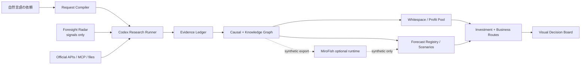

# Opportunity Intelligence

市場のメガトレンド、因果構造、ホワイトスペース、利益プール、投資ルート、事業機会を、同じ証拠台帳から組み立てる個人用の意思決定アプリです。既存の **Foresight Radarとは別プロジェクト** です。Foresight Radarは外部シグナル収集モジュールとしてだけ利用します。

## まず使う

1. [START.cmd](START.cmd) をダブルクリックします。
2. ブラウザの入力欄に、分析したい依頼をそのまま書き「分析runを作成」を押します。
3. 画面の「依頼文をコピー」を押し、このリポジトリを開いているCodexへ貼り付けます。
4. Codexが `run-decision-intelligence` スキルで現在の一次情報を調査し、検証済みの `result.json` を保存します。
5. ブラウザは5秒ごとに結果を確認し、完了すると全分析ビューへ切り替わります。

別のAI APIキーは不要です。AI処理はこのCodexセッションが担当します。ただし、e-Stat、Materials Project、Redditなど個別データ提供者が要求するキーは別です。未設定の接続は `key_required`、未導入MCPは `not_installed` と表示されます。

コマンドで起動する場合は、Node.js 20以上で次を実行します。

```powershell
npm start
```

## 何が動くか

- 自由入力を、意思決定タイプ・地域・産業・時間軸・方法論・必須出力へコンパイル
- run単位で依頼、状態、結果、予測更新をローカル永続化
- 結論、Decision Spine、メガトレンドレーダー、変革/ナレッジグラフ
- ホワイトスペース行列、バリューチェーン/利益プール
- 投資伝播ルート、事業機会ルート、シナリオラボ
- URL、日付、source tier、Fact/Inference/Assumption/Unknown、限界、反証を持つ証拠台帳
- 解像期限、確率更新、YES/NO結果、Brier scoreを持つ予測台帳
- 7地域、11産業、16方法論、国内外のMCP/API/手動取込を含む接続台帳
- World Bank、Eurostat、Crossref、GitHub Public Searchの組み込みno-secret APIアダプタ
- MiroFishへ渡すシナリオ/グラフの分離エクスポート

## 製品の境界



MiroFishのコードは組み込んでいません。AGPL-3.0の別ランタイムとして接続し、出力は `synthetic` として事実から分離します。自動売買機能はありません。利益を保証するものではなく、判断ロジック、期待差、反証、下方リスクを検証可能にする道具です。

## 開発・検証

```powershell
npm test
npm run pending
npm run validate -- <run-id>
```

詳細は [実装仕様](docs/PRODUCT-SPEC.md)、[接続仕様](docs/CONNECTORS.md)、[結果スキーマ](schemas/result.schema.json) を参照してください。
